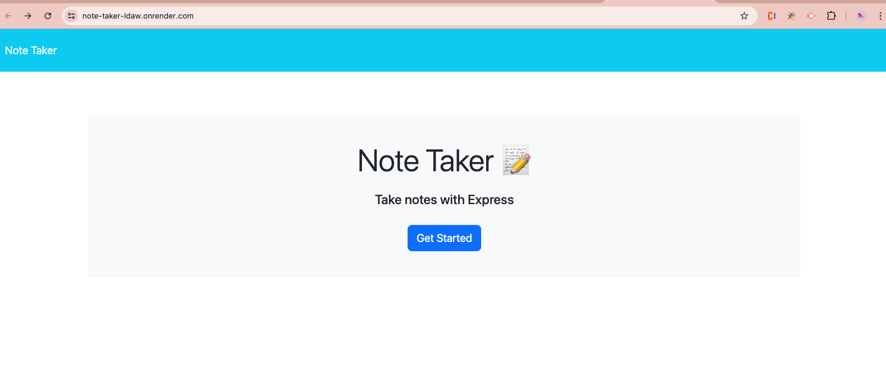
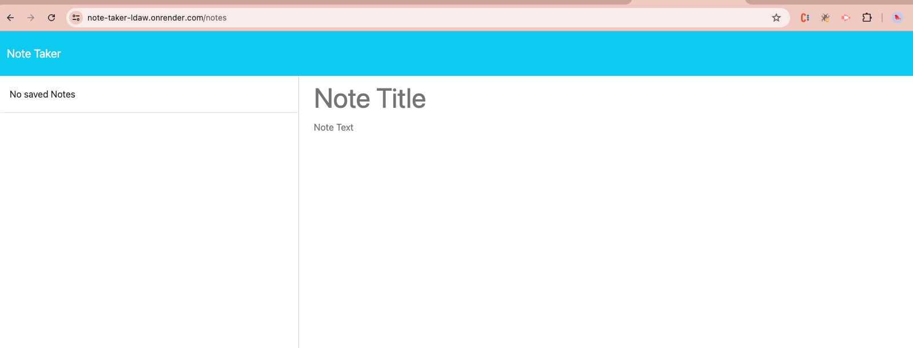
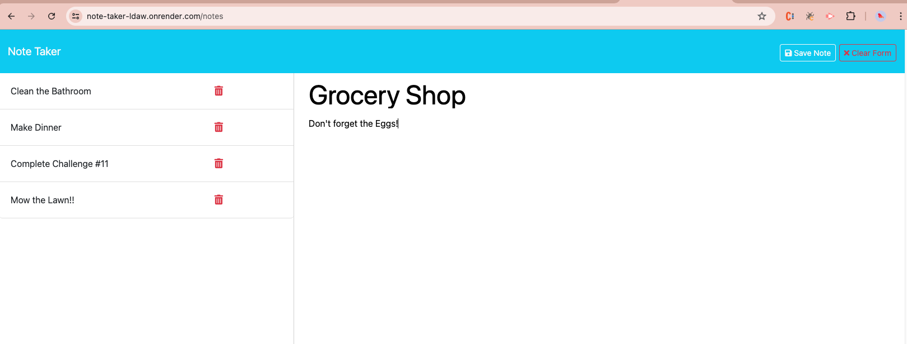

# Note Taker

[](https://opensource.org/licenses/MIT)

## Description

This project involved modifying starter to create the back-end functionality of this note-tracking page and connecting the back-end to the front-end. To modify the code, JavaScript, Express, and Node were primarily used.

You can visit the page by clicking [here](https://note-taker-ldaw.onrender.com/). Please note that it may take a few moments for the page to pull up correctly.

## Table of Contents

- [Installation](#installation)
- [Usage](#usage)
- [Credits](#credits)
- [License](#license)

## Installation

### Clone this repository

```
git clone git@github.com:danimsteger/note-taker.git
```

### Go into this repository

```
cd note-taker
```

### Access code of the repository

```
code .
```

### Install Necessary Dependencies on local device

```
npm install
```

## Usage

To view the program, navigate to the cloned repository and run the following command in your terminal to invoke the application:

```
npm start
```

From there, you can visit the local host link: [http://localhost:3001](http://localhost:3001)

You can also view the application by directly going to the deployed page via Render by clicking [here](https://note-taker-ldaw.onrender.com/).

The page will look like the following when a user initially navigates to it:



On the page, when the "Get Started" button is clicked, the user will be directed to a new page and the URL will have "/notes" at the end. The notes on the left-hand side will be blank initially, and there will be a text-entry form to input a note title and accompanying text.



From there, users can input a note title and text. As a user begins typing a title or text, a red "Clear Form" button appears in the right-hand corner. If the "Clear Form" button is clicked, the input fields will reset.

After a user has inputed both a title and text, a white "Save Note" button will appear in the right-hand corner. If either the title or text is left blank, the button will not appear. Once the "Save Note" button has been pressed, the input fields will reset, and the note title will populate on the left side of the page.



All previously inputed notes can be found on the left side of the page. From there, users can click on a previous note and it will pull up the title and text of that note on the right. Users can enter a new notes, by clicking the "New Note" button that appears. Additionally, users can delete a note by clicking the trashcan symbol for that note.

Users can also view the api of all the current notes by navigating to the URL and "/api/notes".


## Credits

This project was created by Danielle Steger. To complete this project, several resources were referenced, adopted, and modified. Specifically, materials provided in Module 11 of edX Boot Camps LLC were referenced and modified. Additionally, several articles on "MDN Web Docs" and "W3Schools" were referenced. This project was completed with the use of node and its corresponding documentation was referenced as well.

## License

Distributed under the MIT License. See [LICENSE](LICENSE).
